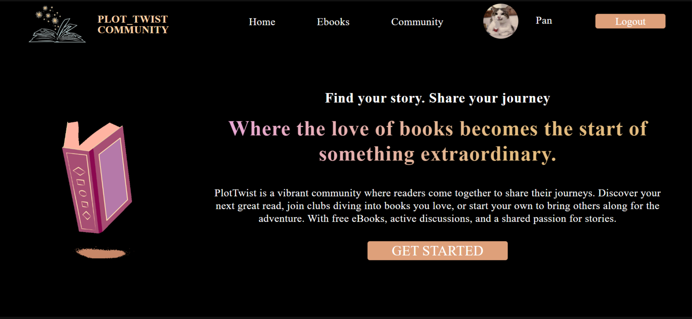
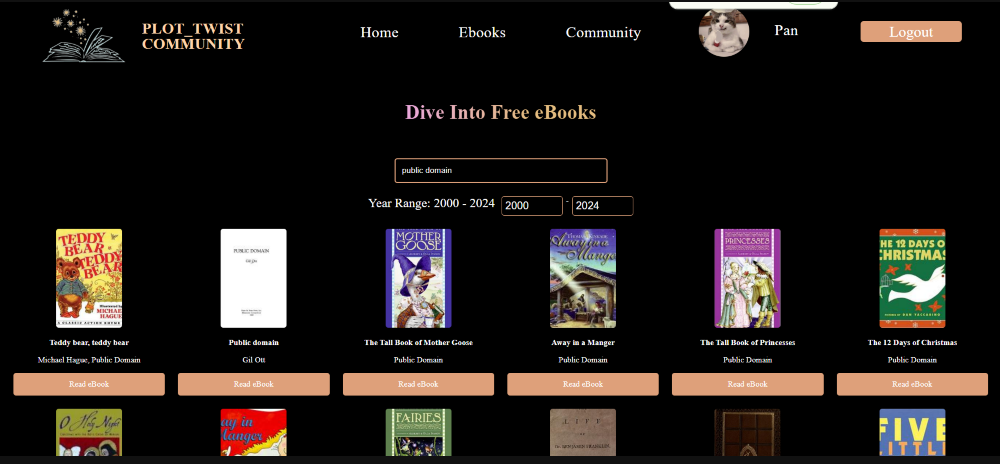
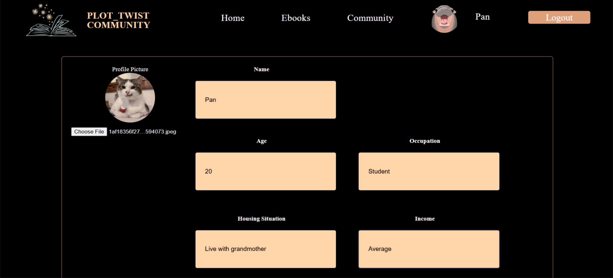

# README

Ebook communications group with Ruby on Rails!

## Environment Requirements

Ensure your system meets the following requirements:

- **OS:** Ubuntu 20.04+
- **Ruby:** 3.2.2
- **Node.js:** 20.0+
- **Yarn:** 1.0.0+

## Quick Start

1. **Clone the repository:**

    ```bash
    git clone https://github.com/TakdanaiGH/ebook-community.git
    cd ebook-community
    ```

2. **Install dependencies:**

    ```bash
    bundle install
    ```

3. **Set up the database:**

    ```bash
    bin/rails db:migrate
    ```

4. **Install Webpack:**

    ```bash
    bin/rails webpacker:install
    ```

5. **Start the server:**

    ```bash
    bin/rails s
    ```

6. Open your browser and navigate to:  
    [http://localhost:3000](http://localhost:3000)
   
## Our Website

  
  



